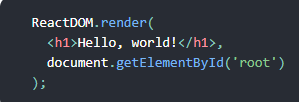

# What Is React?
React is a declarative, efficient, and flexible JavaScript library for building user interfaces. It lets you compose complex UIs from small and isolated pieces of code called “components”.
+ React.Component:
 React component class, or React component type
A component takes in parameters, called props (short for “properties”), and returns a hierarchy of views to display via the render method.

 React takes the description and displays the result. In particular, render returns a React element, which is a lightweight description of what to render.
 
The Square component renders a single button and the Board renders 9 squares. The Game component renders a board with placeholder values which we’ll modify later. There are currently no interactive components.

“JSX: makes these structures easier to write. 

The smallest React example looks like this:

 

it displays a heading saying “Hello, world!” on the page.

Why JSX?
React embraces the fact that rendering logic is inherently coupled with other UI logic: how events are handled, how the state changes over time, and how the data is prepared for display.
Instead of artificially separating technologies by putting markup and logic in separate files, React separates concerns with loosely coupled units called “components” that contain both. We will come back to components in a further section, but if you’re not yet comfortable putting markup in JS, this talk might convince you otherwise.

