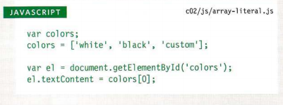

# how to add markup to the text that appears on your pages.?
* Structural markup:
- headings:HTML has six "levels" of headings (h1-h6)
- paragraphs:To create a paragraph, surround the words that make up the paragraph with an opening tag and closing p tag.
- Bold :By encloding words in the tags **b** we can make characters appear bold.
- Italic: By encloding words in the tags *i* we can make characters appear italic.
- Superscript:The **sup** element is used to contain characters that should be superscript such as 2^2
- Subscrip: The **sub** element is used to contain characters that should be subscript. H2O
- White Space:When the browser comes across two or more spaces next to each other, it only displays one space
- Line Breaks : to add a line break inside the middle of a paragraph you can use the line break tag **br /**.
- Horizontal Rules :you can add a horizontal rule between sections using the **hr /** tag.
* Semantic markup:There are some text elements that are not intended to affect the structure of your web pages, but they do add extra  information to the pages .
+ Strong & Emphasis:The use of the **strong** element indicates that its content has strong importance ,The **em** element indicates emphasis that subtly changes the meaning of a sentence.
+ Quotations:The **blockquote** element is used for longer quotes that take up an entire paragraph.
+ Abbreviations: If you use an abbreviation or  an acronym, then the **abbr** element can be used.
+ Citations & Definitions:the **cite** element can be used to indicate where the citation is from,The **dfn** element is used to indicate the defining instance of a new term.
+ Author Details:use **address** element to contain contact details for the author of the page.
<>
<>
# Introducing CSS
* **how CSS works?**
- CSS allows you to create rules that control the way that each individual box (and the contents of that box) is presented

* **how to write CSS rules?**
+ CSS works by associating rules with HTML elements. These rules govern  how the content of specified elements should be displayed. A CSS rule contains two parts: a selector and a declaration.

+ **Declarations** are made up of two parts: the properties of the element that you want to change, and the values  of those properties. For example, the font-family  property sets the choice of font, and the value arial specifies Arial as the preferred typeface

* **how CSS rules apply to HTML pages?**
- [Using External CSS](https://www.youtube.com/watch?v=QT_lIti-8Zk)
- [Using Internal CSS](https://www.youtube.com/watch?v=o2hQUHGueXY)
- [Using inline CSS](https://www.youtube.com/watch?v=bHxGUfgbrY8)

# HOW HTML, CSS, & JAVASCRIPT FIT TOGETHER?
Starting with the HTML layer allows you to focus on the most important thing about your site content, Adding the CSS rules in a separate file keeps rules regarding how the page looks away from the content itself,The JavaScript is added last and enhances the usability of the page or the experience of interacting with the site.  
- The HTML **script** element is used in HTML pages to tell the browser to load the JavaScript file

 ## JS STATEMENTS :
 **/* MULTI-LINE COMM ENTS */**
 **//single line comment**
 **var** x = 1; (put a number or "string" in x variable more thane once)
 **let** x =1; (put a number or "string" in x variable one time)

 ## DATA TYPES
 1. NUMERIC DATA TYPE :The numeric data type handles numbers.
 2. STRING DATA TYPE :The strings data type consists of letters and other characters. 
 3. BOOLEAN DATA TYPE :Boolean data types can have one of two values: true or false. 

 ### ARRAYS 
 An array is a special type of variable. It doesn't just store one value; it stores a list of values.
 

## comparison operators:
**if statment** : only runs a set of statements if the condition is true.
 **if ... else**: statement runs one set of code if the condition in if is false.

|operator|name|PURPOSE
|---|---|---|
| == |  equal to | its compare two values to see if they are the same  value|
|!= |not equal to | its compare two values to see if they are not  the same value|
|=== |strict equal to  |its compare two values to see if they are the same type and value|
|!== |strict equal not  to |its compare two values to see if they are not  the same data and value|
|> |greater than| its checks if the number on the left greater than the number on the right |
|<| less than |its checks if the number on the left less than the number on the right| 
|>=| greater thane or equal to| its checks if the number on the left greater than  or equal to the number on the right |
|<= |less than or equal to| its checks if the number on the left less than or equal to  the number on the right |
|&& | and  | its give you true only if the two sides are true |
|   |or | its gives you false only if the two sides are false |
| ! | not | its gives you the opposit logic |

 

**for loop** :if you want to run the code repeatedly withe specifc number of time

**while loop**: if you want to run the code repeatedly withe  more than one time and you dont know how many time .

**do while loop**: its always run the statment onece even if the condition is false 

### the counter :
* initialization:create a variable and set it to a number
* condition :the number of time that the program repeate
* update : adds or subtract  the counter 

:

