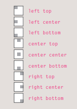
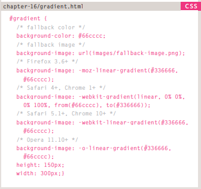
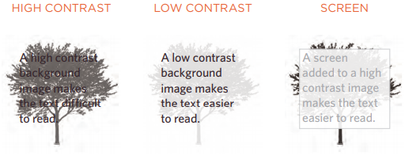
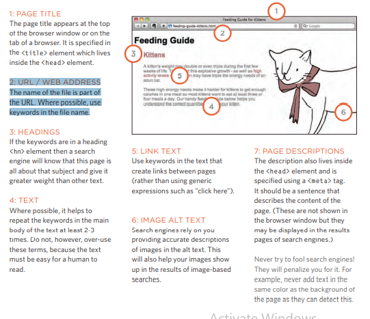

# controlling sizes of images in CSS
* img.large { width: 500px; height: 500px; 
* img.medium { width: 250px; height:250px;}
* img.small { width: 100px; height: 100px;}

# Aligning images:
 1: The float property is added to the class that was created to represent the size of the image

 2: New classes are created withnames such as align-left or align-right to align the images to the left or right of he page. 

 * Centering images Using

1: On the containing element, you can use the text-alignproperty with a value of center.

2: On the image itself, you can use the use the margin property and set the alues of the left and right margins to auto.

# Background Images
background-image: url("images/pattern.gif");

# Repeating Images:
background-repeat,background-attachment:
* repeat The background image is
repeated both horizontally and vertically 
* repeat-x: The image is repeated horizontally only 
* repeat-y:The image is repeated vertically only.
* no-repeat The image is only shown once.
* fixed The background image stays in the same position on the page.
* scroll
The background image moves up and down as the user scrolls up and down the page.

# Background Position:

* 50% 50%, centers the image horizontally and vertically.
 * The top left corner is equal to 0% 0%. 

# shorthand: 
background:
1: background-color
2: background-image
3: background-repeat
4: background-attachment
5: background-position

CSS3 is going to introduce the ability to specify a gradient for the background of a box. The gradient is created using the background-image property and, at the time of writing, different browsers required a different syntax

# Contrast of background images

# Practical Information

## Search Engine Optimization (SEO) :

SEO is a huge topic and several books have been written on the subject. The following pages will help you understand the key concepts so you can improve your website's visibility on search engines.

etermining which keywords to use on your site can be one of the hardest tasks when you start to think about SEO. Here are six steps that will help you identify the right keywords and phrases for your site.

1: Brainstorm:List down the words that someone might type into Google to find your site. Be sure to include the various topics, products or services your site is about

2: Organize Group the keywords into separate lists for the different sections or categories of your website.

3: Research There are several tools that let you enter your keywords and then they will suggest additional keywords you might like to consider.

4: Compare It is very unlikely that your site will appear at the top of 
the search results for every keyword. his is especially true for topics where there is a lot of competition

5: Refine Now you need to pick which keywords you will focus on. These should always be the ones that are most relevant to each section of your site.

* Search engine optimization helps visitors find your sites when using search engines.
* Analytics tools such as Google Analytics allow you to see how many people visit your site, how they find it,and what they do when they get there.
* To put your site on the web, you will need to obtain a domain name and web hosting.
* FTP programs allow you to transfer files from your local computer to your web server.
* Many companies provide platforms for blogging, email newsletters, e-commerce and other popular website tools (to save you writing them from scratch).