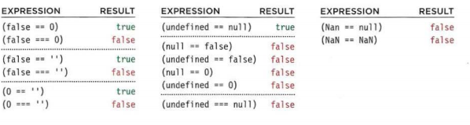

# listis

|the list|what it is |why to use it|haw to use it |
|---|---|---|---|
|  **number list** |the each item in this list is numberd | to creat orderd list| by opening and closing **UL** tag ,each item created with il tag |
|  **bullet list** |the list thhat begin with bullet point|to creat unorderd list |by opening and closing **oL** tag ,each item created with il tag |
|  **definetion list** | the terms ar alonge withe there defention |to creat a list of definetion|every  elemen shold be created with **dt** tag and evry deffenition shoud be  inside **dd** tag |

*you can creat a sub list ,by put the list tag inside  li tag*

# Boxes

## Control the dimensions of your boxes

width , height: to controle the box dimensions .

* px:acuratly controle the size.
* % : relative to the size of the prowser or the pearant size.
* em:based on the size of the text .

#### Limiting Height

when the  browser is expanded and shrink use :
min-hight , min-width :the smalest dimension the box can disblay .
max-hight , max-width :the maximum dimension the box can display .

overflow:

* hidden:hiddes any external cntain dos not match the box.
* scrol: adds scrol bar to the box.

## Border, Margin & Padding

If you specify a width for a box, then the borders, margin, and padding are added to its width and height.

**border-width**: used to control the width  of a border thin ,medium or thick.
**border-style** :control the style of a border.
**border-color**:specify the color of a border using either RGB values, hex codes or CSS color names .
**padding**:allows you to specify how much space should appear between the content of an element and its border.
**margin**: controls the gap between boxes. Its value is commonly given in pixels.
*Block-level boxes can be made into inline boxes, and inline boxes made into block-level boxes.*

# array

An array is a special type of variable. It doesn't just store one value; it stores a list of values.
CREATING AN ARRAY :

* array literal  :
  colors ['white', 'black', ' custom'];

* array constructor.
 colors= ['white',
'black',
'custom'];

**VALU ES IN ARRAYS**:
the array convweart the data to a number in the memory of it
any number  in array calld an index
II Create the array

var colors = ['white',
'black' ,
'custom'];
**Update the third item in the array**
colors[2] = 'beige ' ;
**Get the element with an id of col ors**
var el = document .getElementByid(' colors') ;
**Replace with third item from the array**
el .textContent = colors[2];

# switch statment:

A switch statement starts with a variable called the switch value. Each case indicates a possible value for this variable and the code that should run if the variable matches that value.

• You have a default option that is run if none of the cases match.
• If a match is found, that code is run; then the break statement stops the rest of the switch statement running

type coercion: JavaScript can convert data types behind the scenes to complete an operation

avaScript is said to use weak typing because the data type for a value can change.
Falsy values are treated as if they are fa1se.: 0 , fals , 10/'score' ,NAN

Truthy values: are treated as if they are true. Almost everything that is not in the falsy table can be treated as if it were true.

### CHECKING EQUALITY & EXISTENCE

