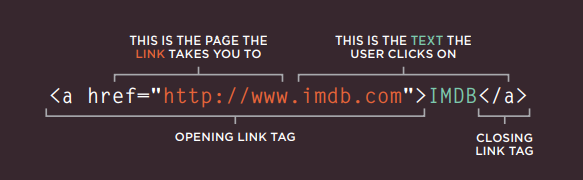
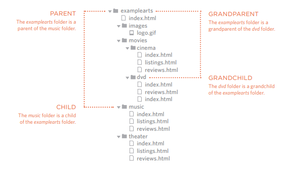
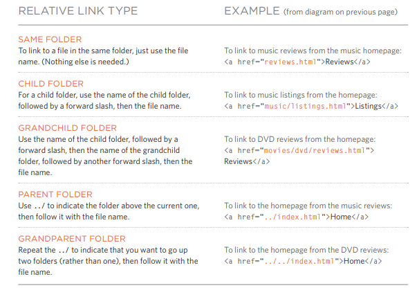
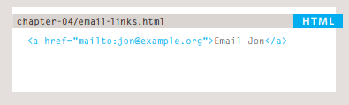
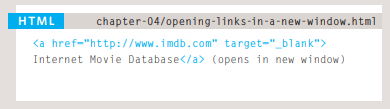
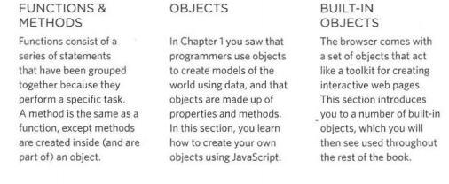
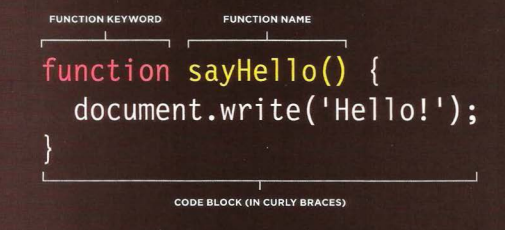

# how to write links

Users can click on anything that appears between the opening **a**tag and the closing **/a**
 ### Linking to Other Sites
the value of the hrefattribute will be the full web address for the site, which is known as an absolute URL.

### Linking to Other Pages on the Same Site
you do not need to specify the domain name in the URL. You can use a shorthand known as relative URL.

### Directory Structure

### Relative URLs
Relative URLs can be used when linking to pages within your own website. They provide ashorthand way of telling the browser where to find your files

### Email Links

### opening Links in a New Window

f you want a link to open in a new window, you can use the target attribute on the opening **a** tag. The value of this attribute should be _blank

### Linking to a Specific Part of the Same Page
Before you can link to a specific part of a page, you need to identify the points in the page that the link will go to.
u use the **a** element again, but the value of the href attribute starts with the #symbol.

ch15:
**block-level elements**
start on a new line Examples:h1, p, ul ,li
**Inline elements**
flow in between surrounding text Examples :img ,b,i

containing element: the outer box that contain another block-level 

CSS has the following positioning schemes that allow you to control the layout of a page: normal flow, relative positioning, and absolute positioning.
 
 
 # js

 

# declering a function:
 
calling function :

## [6 Reasons for Pair Programming](https://www.codefellows.org/blog/6-reasons-for-pair-programming/)
How does pair programming work?
by
the Driver: manages the text editor, switching files, version control, and—of course writing—code. 
The Navigator: uses their words to guide the Driver but does not provide any direct input to the computer. 

Why pair program?
two programmers may come to a solution faster than one programmer on their own. Also, when the pair is stuck, both programmers can research the problem and reach a solution faster
1. Greater efficiency:
two programmers may come to a solution faster than one programmer on their own. Also, when the pair is stuck, both programmers can research the problem and reach a solution faster.
2. Engaged collaboration :
When two programmers focus on the same code, the experience is more engaging and both programmers are more focused than if they were working alone. 

3. Learning from fellow students:
 working with a teammate can expose developers to techniques they otherwise would not have thought of.
4. Social skills:
 Pair programming not only improves programming skills, but can also help programmers develop their interpersonal skills. 
5. Job interview readiness:
For most roles, the ability to work with and learn from others and stellar communication skills are as (or more!) important to a company than specific technical skills. Pair programming strengthens all of those skills.
6. Work environment readiness:
Code Fellows graduates who are already familiar with how pairing works can hit the ground running at a new job, with one less hurdle to overcome.
 