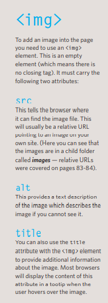

## img 

height:This specifies the height of the image in pixels.
width:This specifies the width of the image in pixels.
Where to Place Images in Your Code:
1: before a paragraphThe paragraph starts on a new line after the image.
2: inside the start of a paragraphThe first row of text aligns with the bottom of the image.
3: in the middle of a paragraphThe image is placed between the words of the paragraph that it appears in.

Three Rules for Creating Images:
1. Save images in the right format
2. Save images at the right size
3. Use the correct resolution

The **img** element is used to add images to a web page.
 You must always specify a src attribute to indicate the source of an image and an alt attribute to describe the content of an image.
 You should save images at the size you will be using them on the web page and in the appropriate format.
Photographs are best saved as JPEGs; illustrations or logos that use flat colors are better saved as GIFs

you can add a color with 2 more than 1 way :
* name: blu , red , any color you can nam 
* hexadecimal: use #then the number of the color in hexa
* rgb: red green blue method ,
* hsl: hue saturation light method
you can use **hsla** or **rgba** to controle the opacity 

When picking foreground and background colors, it is important to ensure that there is enough contrast for the text to be legible

There are properties to control the choice of font, size, weight, style, and spacing.

There is a limited choice of fonts that you can assume most people will have installed.

If you want to use a wider range of typefaces there are several options, but you need to have the right license to use them.

You can control the space between lines of text, individual letters, and words. Text can also be aligned to the left, right, center, or justified. It can also be indented.

You can use pseudo-classes to change the style of an  element when a user hovers over or clicks on text, or  when they have visited a link.

