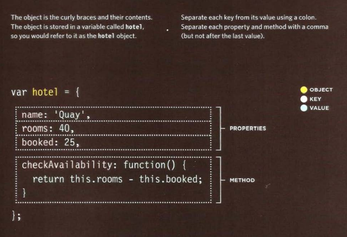
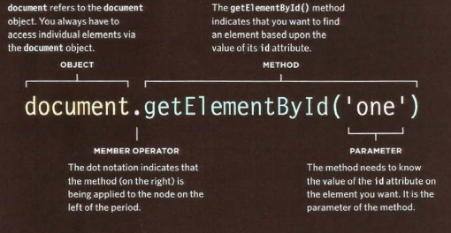
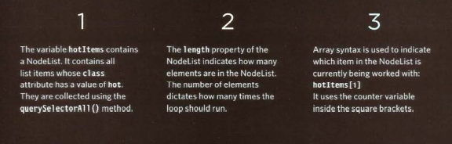
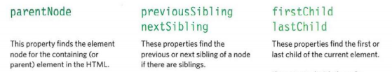
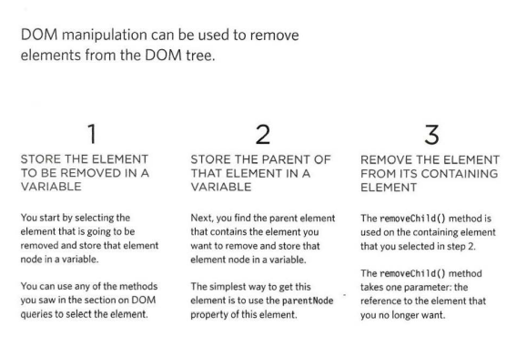

# Understanding The Problem Domain Is The Hardest Part Of Programming

by taking away the problem domain, or making it so trivial that it is easily understood, you will be able to make both teaching and learning easier.

### Why problem domains are hard:
Many of the problem domains we face as programmers are difficult to understand and look completely different depending on your viewpoint.

Just try and read the famous Domain Driven Design book and you’ll quickly see how complicated and difficult problem domains can be. 

### Just try and read the famous Domain Driven Design book and you’ll quickly see how complicated and difficult problem domains can be. 

It is very difficult to solve a problem before you know the question.  It’s like buzzing in on Jeopardy before you hear the clue and shouting out random questions.

### What can you do about it?
1. Make the problem domain easier:You can often make the problem domain easier by cutting out cases and narrowing your focus to a particular part of the problem.
2. Get better at understanding the problem domain:It is easy to fall into the trap of thinking you understand enough of the problem to get started coding it.

# WHAT IS AN OBJECT? 
Objects group together a set of variables and functions to create a model of a something you would recognize from the real world. In an object, variables and functions take on new names. 

* VARIABLES BECOME KNOWN AS PROPERTIES. tell us about the object,
* FUNCTIONS: BECOME KNOWN AS METHODS.represent tasks that are associated with the object. 

### how to creat object :
 literal notation:
 
 
 
 

* Accessing An objecgt and dot notation :

###The Document Object Model (DOM) specifies 
how browsers should create a model of an HTML page and how JavaScript can access and update the contents of a web page while it is in the browser window. 
* MAKING A MODEL OF THE HTML PAGE :When the browser loads a web page, it creates a model of the page in memory. The DOM specifies the way in which the browser should structure this model using a DOM tree. 

* ACCESSING AND CHANGING THE HTML PAGE :The DOM also defines methods and properties to access and update each object in this model, which in turn updates what the user sees in the browser. 

* THE DOM TREE IS A MODEL OF A WEB PAGE.

WORKING WITH THE DOM TREE:
* STEP 1: ACCESS THE ELEMENTS 
* STEP 2: WORK W ITH THOSE ELEMENTS

 

  NODELISTS: DOM QUERIES THAT RETURN MORE THAN ONE ELEMENT
  
  SELECTING AN ELEMENT FROM A NODELIST :
  
  
  
  
  
  
  
  
  
  

LOOPING THROUGH A NODELIST:
If you want to apply the same code to numerous elements, looping through a Nodelist is a powerful technique. 

TRAVERSING THE DOM:

WHITESPACE NODES :

Traversing the DOM can be ifficult because some browsers add a text node whenever they come across whitespace between elements.

* From an element node, you can access and update its content using properties such as textContent and i nnerHTML or using DOM manipulation techniques. 
* An element node can contain multiple text nodes and child elements that are siblings of each other. 
* In older browsers, implementation of the DOM is inconsistent (and is a popular reason for using jQuery). 
* Browsers offer tools for viewing the DOM tree . 
