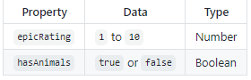
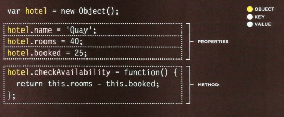

# Domain Modeling:
Domain modeling is the process of creating a conceptual model in code for a specific problem.
object-oriented:An entity that stores data in properties and encapsulates behaviors in methods .

## Define a constructor and initialize properties:
JavaScript representation of an EpicFailVideo object.:

# Generate random numbers
EpicFailVideo's prototype is given a generateRandom method which is assigned a function with two parameters called min and max. The function uses both Math.floor and Math.random to calculate and return a random integer between min and max.

# Calculate daily Likes
Popularity of a video is measured in Likes. And the formula for calculating Likes is the number of viewers times the percentage of viewers who'll Like a video. In other words, viewers times percentage.

* When modeling a single entity that'll have many instances, build self-contained objects with the same attributes and behaviors.
* Model its attributes with a constructor function that defines and initializes properties.
* Model its behaviors with small methods that focus on doing one job well.
* Create instances using the new keyword followed by a call to a constructor function.
* Store the newly created object in a variable so you can access its properties and methods from outside.
* Use the this variable within methods so you can access the object's properties and methods from inside.

# Tables
When representing information in a table, you need to think in terms of a grid made up of rows and columns

### What's a Table?
A table represents information in a grid format.Examples of tables include financial reports.

## Basic Table Structure:

`<table>`:The `<table>` element is used to create a table. The contents of the table are written out row by row.

`<tr>`:You indicate the start of each row using the opening `<tr>` tag. 

`<td>`:Each cell of a table is 
represented using a `<td>`
element. 

`<th>`:The `<th>` element is used just like the `<td>` lement but its purpose is to represent the heading for either a column or a row. 

* The `<table>` element is used to add tables to a web page.
* A table is drawn out row by row. Each row is created with the `<tr>` element.
* Inside each row there are a number of cells represented by the `<td>` element (or `<th>` if it is a header).
* You can make cells of a table span more than one row or column using the rowspan and colspan attributes.
* For long tables you can split the table into a `<thead>`, `<tbody>`, and `<tfoot>`

## object:

