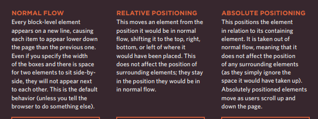

**CSS treats each HTML element as if it is in its own box. This box will either be a block-level box or an inline box.**

## Containing Elements:
If one block-level element sits inside another block-level lement then the outer box is known as the containing or parent element.

# Controlling the Position of Elements:

**box offset** properties to tell the browser how far from the top or bottom and left or right it should be placed. 

**position:static**:appear in normal flow.

**position:relative**:Relative positioning moves an element in relation to where it would have been in normal flow.

**position:absolute**:When the position property is given a value of absolute, the box is taken out of normal flow and no longer affects the position of other elements on the page. 

**position:fixed**:Fixed positioning is a type of absolute positioning that requires the position property to have a value of fixed.

**z-index**:When you use elative, fixed, or absolute positioning, boxes can overlap. If boxes do overlap, the elements that appear later in the HTML code sit on top of those that are earlier in the page.

**clear**:he clear property allows you to say that no element (within the same containing element) should touch the left or righthand sides of a box. It can take the following values:

* left
* right
* both
* none

**CREATING Multi-Column Layouts with Floats**

* width
This sets the width of the 
columns.
* float
This positions the columns next 
to each other.
* margin
This creates a gap between the 
columns.

**Screen Sizes:**
Different visitors to your sitewill have different sized screens that show different amounts of information, so your design needs to be able to work on a range of different sized screens.

**Screen Resolution**
Resolution refers to the number of dots a screen shows per inch. Some devices have a higher resolution than desktop computers and most operating systems allow users to adjust the resolution of their screens.

**Page Sizes**
Because screen sizes and display resolutions vary so much, web designers often try to create pages of around 960-1000 pixels wide .

