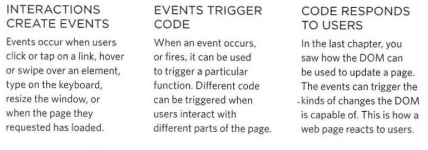
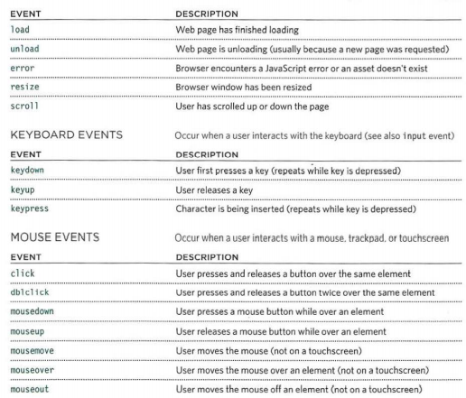

## Why Forms?
*  enabling users to 
search, forms also allow users to perform other functions online.

* see forms when registering as a member of a website, when shopping online, and when signing up for newsletters or mailing lists.

## Form Controls:
 types of form controls that 
you can use to collect information from visitors :
1. ADDING TEXT:Text input ,Password input,Text area 
2. Making Choices:Radio buttons,Checkboxes,Drop-down boxes
3. Submitting Forms:Submit buttons,Image buttons
4. Uploading Files:File upload

### Form Structure:
`<form action="http://www.example.com/subscribe.php"method="get">
This is where the form controls will ppear. 
</form>`

### Text Input:
`<form action="http://www.example.com/login.php">
Username: <input type="text" name="username" size="15"  maxlength="30" /> 
</form>`

### Password Input:
`form action="http://www.example.com/login.php">
Username: <input type="text" name="username" size="15"  maxlength="30" /> 

Password: <input type="password" name="password" size="15"  maxlength="30" />
</form>`

*  Whenever you want to collect information from visitors you will need a form, which lives inside a `<form>` element.
* Information from a form is sent in name/value pairs.
* Each form control is given  name, and the text the user types in or the values of the options they select are sent to the server.
* HTML5 introduces new form elements which make it easier for visitors to fill in forms.

# Lists, Tables and Forms
* In addition to the CSS properties covered in other chapters which work with the contents of all elements,there are several others that are specifically used to control the appearance of lists, tables, and forms.
* List markers can be given different appearances using the list-style-type and list-style image properties.
* Table cells can have different orders and spacing in different browsers, but there are properties you can use to control them and make them more consistent. 
* Forms are easier to use if the form controls are vertically aligned using CSS.
* Forms benefit from styles that make them feel more interactive.

# Events

W hen you browse the web, your browser registers different types of events. It's the browser's way of saying, "Hey, this just happened." Your script can then respond to these events. 

### HOW EVENTS TRIGGER JAVASCRIPT CODE ?

1. Select t he element node(s) you want the script to respond to. 

2. Indicate which event on the selected node(s) will trigger the response. 

3. State the code you want to run when the event occurs.

## THREE WAYS TO BIND AN EVENT TO AN LEMENT :

* HTML EVENT HANDLERS :This is bad ractice, but you need to be aware of it because you may see it in older code. 
* TRADITIONAL DOM EVENT HANDLERS :Support in all major browsers is very strong for this approach. The main drawback is that you can only attach a single function to any event. For example, the submit event of a form cannot trigger one function that checks the contents of a form, and a second to submit the form data if it passes the checks. 
* DOM LEVEL 2 EVENT LISTENERS :The yntax is quite different and, unlike traditional event handlers, these newer event listeners allow one event to trigger multiple functions. As a result, there are less likely to be conflicts between different scripts that run on the same page. 

* Events are the browser's way of indicating when something has appened 

* Binding is the process of stating which event you are waiting to happen, and which element you are waiting for that event to happen upon. 

* When an event occurs on an element, it can trigger a JavaScript function. When this function then changes the web page in some way, it feels nteractive because it has responded to the user. 
* You can use event delegation to monitor for events that happen on all of the children of an element. 

* The most commonly used events are W3C DOM events, although there are others in the HTMLS specification as well as browser-specific events.

