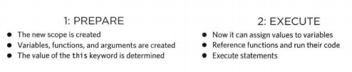
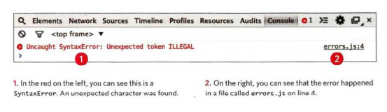

# Error Handling and Debugging:

## how to find the errors in your code?
 ## how to write scripts that deal with potential errors gracefully?

 * When writing a long script, nobody gets everything right in their first attempt. The error messages that a browser gives look cryptic at first, but they can help you determine what went wrong in your JavaScript and how to fix it.

### ORDER OF EXECUTION :
To find the source of an error, it helps to know how scripts are processed. The order in which statements are executed can be complex; some tasks cannot complete until another statement or function has been run.

## EXECUTION CONTEXTS :
* GLOBAL CONTEXT 
Code that is in the script, but not in a function. There is only one global context in any page. 
* FUNCTION CONTEXT Code that is being run within a function. Each function has its own function context. 
* EVAL CONTEXT (NOT SHOWN) Text is executed like code in an internal function called eval() 

**VARIABLE SCOPE**:
* GLOBAL SCOPE
* FUNCTION-LEVEL SCOPE

### EXECUTION CONTEXT & HOISTING :
 there are two phases of activity: 

 

 * UNDERSTANDING ERRORS : If you are anticipating hat something in your code may cause an error, you can use a set of statements to handle the error (you meet them on p480). This is important because if the error is not handled, the script will just stop processing and the user will not know why. So exception-handling code should inform users when there is a problem. 

* ERROR OBJECTS :Error objects can help you find where your mistakes are and browsers have tools to help you read them. 

ERROR OBJECTS CONTINUED:
* Syntax Error 
* Ref erenceError
* Ev alError 
* UR I Error 
* Type Error 
* RangeError
* Error
* NAN

###  HOW TO DEAL WITH ERRORS:

1. DEBUG THE SCRIPT TO FIX ERRORS :If you come cross an error while writing a script (or when someone reports a bug), you will need to debug the code, track down the source of the error, and fix it.

2. HANDLE ERRORS GRACEFULLY:You can handle errors gracefully using try, catch, throw, and f i na 1 ly statements

* HOW TO LOOK AT ERRORS HOW TO LOOK AT ERRORS IN CHROME ?
1. The Console option is selected. 
2. The type of error and the error message are shown in red. 
3. The file name and the line number are shown on the right-hand side of the console. 

* TYPING IN THE CONSOLE IN CHROME

Each time you write a line, the interpreter may respond. Here, it is writing out the value of each variable that has been created. 

**The console.log()** method can write data from a script to the console. If you open console-l og. html, you will see that a note is written to the console when the page loads. 

### HANDLING EXCEPTIONS:
If you know your code might fail, use try, catch, and finally. Each one is given its own code block. 

